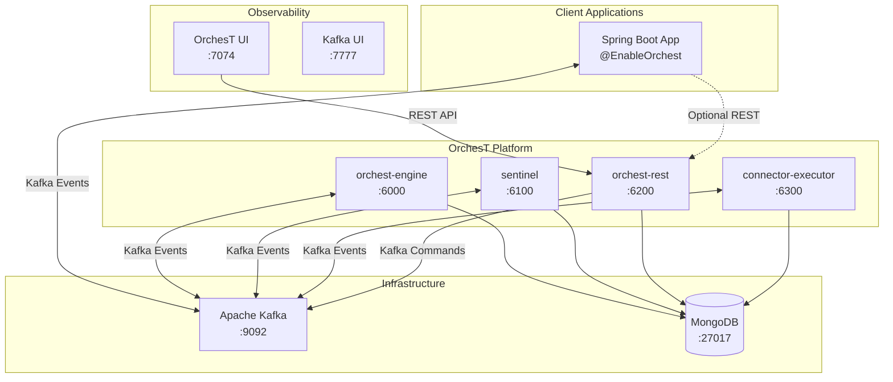
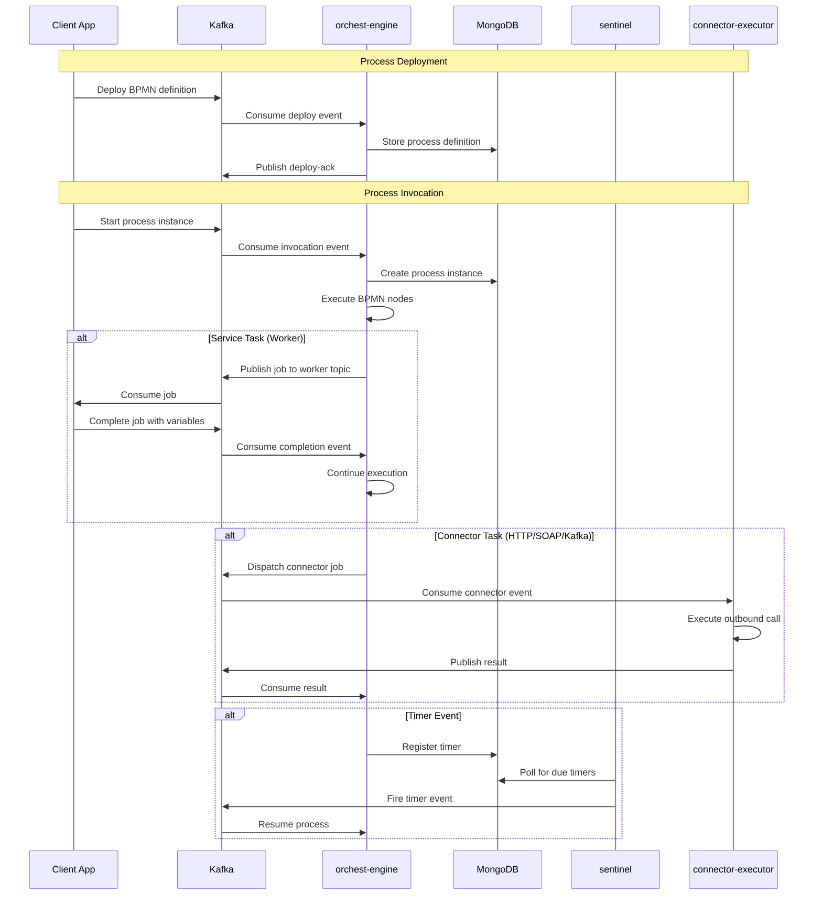
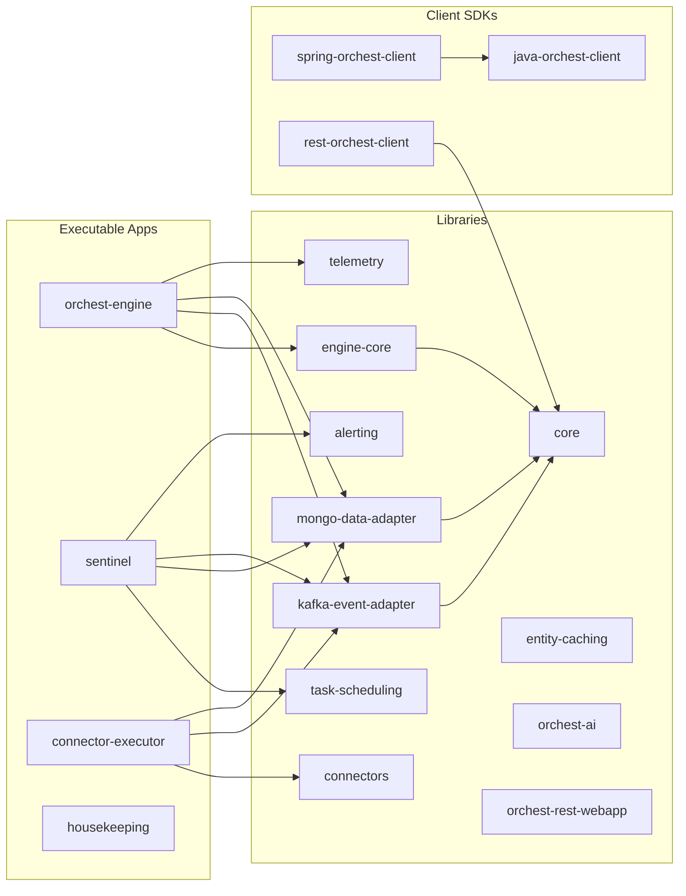

# OrchesT Platform

[](https://api.reuse.software/badge/github.com/telekom/orchest) 
[](https://www.bestpractices.dev/projects/PLACE-HOLDER)

OrchesT is a scalable, distributed workflow orchestration platform for executing BPMN 2.0 and DMN 1.3 definitions. It provides a Kafka-driven engine with Spring Boot client integration, MongoDB persistence, and a full REST API for managing process lifecycles.

## Architecture Overview



## Request Flow



## Module Structure



## Prerequisites

| Requirement | Version | Notes |
|-------------|---------|-------|
| Java | 21 | Required (toolchain enforced) |
| Gradle | 8.x | Wrapper included (`./gradlew`) |
| Docker | 20+ | For infrastructure services |
| Docker Compose | v2+ | Included with Docker Desktop |

## Quick Start

### 1. Start Infrastructure

```bash
docker compose -f docker.yml up kafka mongodb -d
```

Wait for healthy status:

```bash
docker compose -f docker.yml ps
```

| Service | Port | Health Check |
|---------|------|------|
| Kafka (KRaft, no Zookeeper) | `localhost:9092` | Broker API versions |
| MongoDB (Replica Set `rs0`) | `localhost:27017` | `rs.status()` |

> MongoDB runs as a replica set because OrchesT uses change streams for real-time event propagation.

### 2. Build the Project

```bash
./gradlew clean build -x test
```

### 3. Run the Engine

```bash
./gradlew :orchest-engine:bootRun
```

The engine starts on **port 6000** and:
- Connects to Kafka and MongoDB using localhost defaults
- Creates required Kafka topics automatically
- Begins consuming process invocation and worker events
- Exposes actuator at `http://localhost:6000/orchest-engine/actuator/health`

### 4. Run Sentinel

```bash
./gradlew :sentinel:bootRun
```

Sentinel starts on **port 6100** and handles:
- Timer event firing (polls MongoDB for due timers)
- Progressive retry of failed tasks
- Background scheduled tasks

### 5. Run the REST API (orchest-rest)

The REST API is packaged in the `orchest-rest-test` module:

```bash
./gradlew :orchest-rest-test:bootRun
```

Starts on **port 6200** with context path `/orchest`:
- Swagger UI: `http://localhost:6200/orchest/swagger-ui.html`
- API docs: `http://localhost:6200/orchest/v3/api-docs`
- Health: `http://localhost:6200/orchest/actuator/health`

### 6. (Optional) Run Connector Executor

```bash
./gradlew :connector-executor:bootRun
```

Starts on **port 6300**, executes outbound connector tasks (REST, SOAP, Kafka, Slack, Teams, WhatsApp, JDBC, OpenAI).

### 7. (Optional) Run the Full Stack with Docker Compose

```bash
docker compose -f docker.yml up -d
```

This starts everything including the UI at `http://localhost:7074`.

## Environment Variables

All services share these variables with safe local defaults:

| Variable | Default | Description |
|----------|---------|-------------|
| `ORCHEST_MONGO_URI` | `mongodb://localhost:27017` | MongoDB connection string |
| `ORCHEST_MONGO_DATABASE_NAME` | `orchest` | Database name |
| `ORCHEST_KAFKA_CONFIG_BOOTSTRAP_SERVERS` | `localhost:9092` | Kafka broker(s) |
| `ORCHEST_KAFKA_SUFFIX` | *(empty)* | Topic name suffix for multi-tenancy |
| `ENGINE_SCALE` | `LOCAL` | Engine scaling mode (`LOCAL` or `DISTRIBUTED`) |
| `ENABLE_KMS` | `false` | AWS KMS encryption (disabled locally) |
| `LOGGING_FORMAT` | `PLAIN` | Log format (`PLAIN` or `JSON`) |
| `SPRING_PROFILES_ACTIVE` | `local` | Active Spring profile |

No additional configuration is needed for local development.

## Creating a Client Application

### 1. Add Dependency

```groovy
dependencies {
    implementation "io.telekom.orchest:spring-orchest-client:${orchest_version}"
}
```

### 2. Enable OrchesT

```java
@SpringBootApplication
@EnableOrchest
public class MyApplication {
    public static void main(String[] args) {
        SpringApplication.run(MyApplication.class, args);
    }
}
```

### 3. Configure Connection

```yaml
orchest:
  enableWorkers: true
  processIds:
    - my-process-id
  kafka:
    config:
      bootstrap-servers: localhost:9092
```

### 4. Implement a Worker

```java
@Component
public class MyWorker {

    @Worker(type = "my-task-type")
    public void handleTask(ActivatedJob job, JobClient client) {
        Map<String, Object> variables = job.getVariablesAsMap();
        
        // Business logic here
        
        client.sendCompleteEvent(job, Map.of("result", "done"));
    }
}
```

### 5. Deploy a BPMN Process

```java
@Component
public class ProcessDeployer {

    @DeployResource(resources = "classpath:processes/my-process.bpmn")
    public void deploy() {
        // Auto-deployed on startup
    }
}
```

## Useful Endpoints

| Service | Endpoint | Description |
|---------|----------|-------------|
| Engine | `http://localhost:6000/orchest-engine/actuator/health` | Health check |
| Engine | `http://localhost:6000/orchest-engine/actuator/metrics` | Metrics |
| REST API | `http://localhost:6200/orchest/swagger-ui.html` | Swagger UI |
| REST API | `http://localhost:6200/orchest/api/v1/process-definitions` | List definitions |
| REST API | `http://localhost:6200/orchest/api/v1/process-instances` | List instances |
| Sentinel | `http://localhost:6100/actuator/health` | Health check |
| Kafka UI | `http://localhost:7777` | Topic browser |
| OrchesT UI | `http://localhost:7074` | Web dashboard |

## Code Formatting

This project uses [Spotless](https://github.com/diffplug/spotless) with [google-java-format](https://github.com/google/google-java-format) for consistent code style.

```bash
# Check formatting
./gradlew spotlessCheck

# Auto-fix formatting
./gradlew spotlessApply
```

An `.editorconfig` is included for IDE support.

## Building & Testing

```bash
# Full build with tests
./gradlew clean build

# Build without tests
./gradlew clean build -x test

# Run specific module tests
./gradlew :core:test
./gradlew :engine-core:test

# Generate coverage report
./gradlew test jacocoAggregateReport
# Report at: build/reports/jacoco/aggregate/html/index.html
```

## Troubleshooting

### Kafka connection refused
Ensure Kafka is healthy: `docker compose -f docker.yml ps`. Kafka needs ~30s to initialize in KRaft mode.

### MongoDB change stream errors
MongoDB must run as a replica set. The `docker.yml` handles this automatically. If running MongoDB manually:
```bash
mongosh --eval 'rs.initiate({_id:"rs0", members:[{_id:0, host:"localhost:27017"}]})'
```

### Port conflicts
Default ports: Engine=6000, Sentinel=6100, REST=6200, Connector=6300. Override with `SERVER_PORT` env var.

## License

Apache License, Version 2.0 - see [LICENSE](LICENSE.txt) for details.
